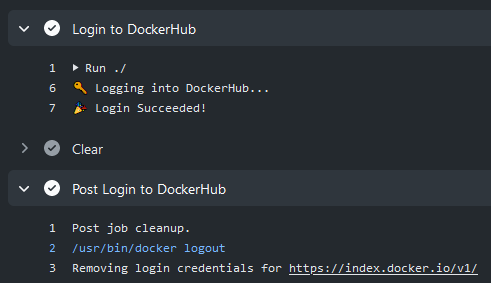

[](https://github.com/docker/login-action/releases/latest)
[](https://github.com/marketplace/actions/docker-login)
[](https://github.com/docker/login-action/actions?workflow=ci)
[](https://github.com/docker/login-action/actions?workflow=test)
[](https://codecov.io/gh/docker/login-action)

## About

GitHub Action to login against a Docker registry.

> :bulb: See also:
> * [setup-buildx](https://github.com/docker/setup-buildx-action) action
> * [setup-qemu](https://github.com/docker/setup-qemu-action) action
> * [build-push](https://github.com/docker/build-push-action) action



___

* [Usage](#usage)
  * [DockerHub](#dockerhub)
  * [GitHub Packages Docker Registry](#github-packages-docker-registry)
  * [GitHub Container Registry](#github-container-registry)
  * [GitLab](#gitlab)
  * [Azure Container Registry (ACR)](#azure-container-registry-acr)
  * [Google Container Registry (GCR)](#google-container-registry-gcr)
  * [AWS Elastic Container Registry (ECR)](#aws-elastic-container-registry-ecr)
* [Customizing](#customizing)
  * [inputs](#inputs)
* [Keep up-to-date with GitHub Dependabot](#keep-up-to-date-with-github-dependabot)
* [Limitation](#limitation)

## Usage

### DockerHub

To authenticate against [DockerHub](https://hub.docker.com) it's strongly recommended to create a
[personal access token](https://docs.docker.com/docker-hub/access-tokens/) as an alternative to your password.

```yaml
name: ci

on:
  push:
    branches: master

jobs:
  login:
    runs-on: ubuntu-latest
    steps:
      -
        name: Login to DockerHub
        uses: docker/login-action@v1
        with:
          username: ${{ secrets.DOCKERHUB_USERNAME }}
          password: ${{ secrets.DOCKERHUB_TOKEN }}
```

### GitHub Packages Docker Registry

You can configure the Docker client to use [GitHub Packages to publish and retrieve docker images](https://docs.github.com/en/packages/using-github-packages-with-your-projects-ecosystem/configuring-docker-for-use-with-github-packages).

```yaml
name: ci

on:
  push:
    branches: master

jobs:
  login:
    runs-on: ubuntu-latest
    steps:
      -
        name: Login to GitHub Packages Docker Registry
        uses: docker/login-action@v1
        with:
          registry: docker.pkg.github.com
          username: ${{ github.repository_owner }}
          password: ${{ secrets.GITHUB_TOKEN }}
```

### GitHub Container Registry

To authenticate against the [GitHub Container Registry](https://docs.github.com/en/packages/getting-started-with-github-container-registry),
you will need to create a new [personal access token (PAT)](https://docs.github.com/en/github/authenticating-to-github/creating-a-personal-access-token)
with the [appropriate scopes](https://docs.github.com/en/packages/getting-started-with-github-container-registry/migrating-to-github-container-registry-for-docker-images#authenticating-with-the-container-registry).

```yaml
name: ci

on:
  push:
    branches: master

jobs:
  login:
    runs-on: ubuntu-latest
    steps:
      -
        name: Login to GitHub Container Registry
        uses: docker/login-action@v1
        with:
          registry: ghcr.io
          username: ${{ github.repository_owner }}
          password: ${{ secrets.CR_PAT }}
```

### GitLab

```yaml
name: ci

on:
  push:
    branches: master

jobs:
  login:
    runs-on: ubuntu-latest
    steps:
      -
        name: Login to GitLab
        uses: docker/login-action@v1
        with:
          registry: registry.gitlab.com
          username: ${{ secrets.GITLAB_USERNAME }}
          password: ${{ secrets.GITLAB_PASSWORD }}
```

### Azure Container Registry (ACR)

[Create a service principal](https://docs.microsoft.com/en-us/azure/container-registry/container-registry-auth-service-principal#create-a-service-principal)
with access to your container registry through the [Azure CLI](https://docs.microsoft.com/en-us/cli/azure/install-azure-cli)
and take note of the generated service principal's ID (also called _client ID_) and password (also called _client secret_).

```yaml
name: ci

on:
  push:
    branches: master

jobs:
  login:
    runs-on: ubuntu-latest
    steps:
      -
        name: Login to ACR
        uses: docker/login-action@v1
        with:
          registry: <registry-name>.azurecr.io
          username: ${{ secrets.AZURE_CLIENT_ID }}
          password: ${{ secrets.AZURE_CLIENT_SECRET }}
```

> Replace `<registry-name>` with the name of your registry.

### Google Container Registry (GCR)

Use a service account with the ability to push to GCR and [configure access control](https://cloud.google.com/container-registry/docs/access-control).
Then create and download the JSON key for this service account and save content of `.json` file
[as a secret](https://docs.github.com/en/actions/configuring-and-managing-workflows/creating-and-storing-encrypted-secrets#creating-encrypted-secrets-for-a-repository)
called `GCR_JSON_KEY` in your GitHub repo. Ensure you set the username to `_json_key`.

```yaml
name: ci

on:
  push:
    branches: master

jobs:
  login:
    runs-on: ubuntu-latest
    steps:
      -
        name: Login to GCR
        uses: docker/login-action@v1
        with:
          registry: gcr.io
          username: _json_key
          password: ${{ secrets.GCR_JSON_KEY }}
```

### AWS Elastic Container Registry (ECR)

Use an IAM user with the [ability to push to ECR](https://docs.aws.amazon.com/AmazonECR/latest/userguide/ecr_managed_policies.html).
Then create and download access keys and save `AWS_ACCESS_KEY_ID` and `AWS_SECRET_ACCESS_KEY` [as secrets](https://docs.github.com/en/actions/configuring-and-managing-workflows/creating-and-storing-encrypted-secrets#creating-encrypted-secrets-for-a-repository)
in your GitHub repo.

```yaml
name: ci

on:
  push:
    branches: master

jobs:
  login:
    runs-on: ubuntu-latest
    steps:
      -
        name: Login to ECR
        uses: docker/login-action@v1
        with:
          registry: <aws-account-number>.dkr.ecr.<region>.amazonaws.com
          username: ${{ secrets.AWS_ACCESS_KEY_ID }}
          password: ${{ secrets.AWS_SECRET_ACCESS_KEY }}
```

> Replace `<aws-account-number>` and `<region>` with their respective values.

## Customizing

### inputs

Following inputs can be used as `step.with` keys

| Name             | Type    | Default                     | Description                        |
|------------------|---------|-----------------------------|------------------------------------|
| `registry`       | String  |                             | Server address of Docker registry. If not set then will default to Docker Hub |
| `username`       | String  |                             | Username used to log against the Docker registry |
| `password`       | String  |                             | Password or personal access token used to log against the Docker registry |
| `logout`         | Bool    | `true`                      | Log out from the Docker registry at the end of a job |

## Keep up-to-date with GitHub Dependabot

Since [Dependabot](https://docs.github.com/en/github/administering-a-repository/keeping-your-actions-up-to-date-with-github-dependabot)
has [native GitHub Actions support](https://docs.github.com/en/github/administering-a-repository/configuration-options-for-dependency-updates#package-ecosystem),
to enable it on your GitHub repo all you need to do is add the `.github/dependabot.yml` file:

```yaml
version: 2
updates:
  # Maintain dependencies for GitHub Actions
  - package-ecosystem: "github-actions"
    directory: "/"
    schedule:
      interval: "daily"
```

## Limitation

This action is only available for Linux [virtual environments](https://help.github.com/en/articles/virtual-environments-for-github-actions#supported-virtual-environments-and-hardware-resources).
